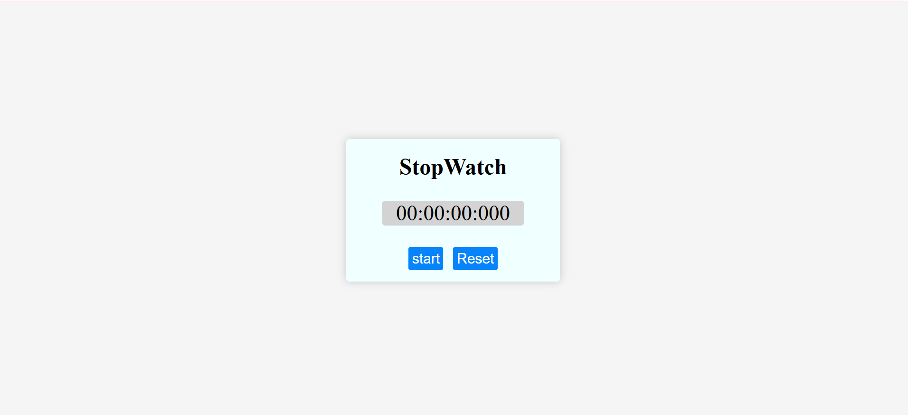

# ⏱ Stopwatch Project

Click [here](https://Hasamudin/#.github.io/Stopwatch)

  
*جای عکس پروژه - مسیر عکس را تغییر دهید.*

---

## 📖 Overview
A simple **Stopwatch App** built with **HTML, CSS, and JavaScript**.  
It allows you to **start, stop, and reset** the timer with millisecond precision.  

---

## ✨ Features
- Start / Stop the stopwatch  
- Reset to zero  
- Time display in **hours : minutes : seconds : milliseconds**  
- Smooth and accurate using `setInterval()`  

---

## 🛠 Technologies
- **HTML5** – Page structure  
- **CSS3** – Styling (you can add your own design)  
- **JavaScript (ES6)** – Stopwatch logic  

---
